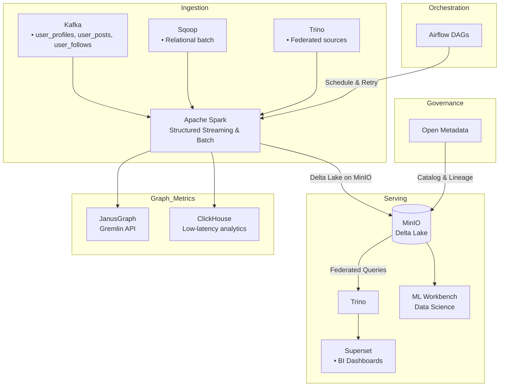

# Medallion Data Platform on MinIO

A self-contained proof-of-concept demonstrating a Medallion-style data lake architecture on MinIO (Delta Lake), ingesting both streaming and batch sources, transforming with Apache Spark, and serving to BI/ML layers via Trino and Superset.

Repository: https://github.com/uzair14137/Medallion-Data-Platform-on-MinIO
